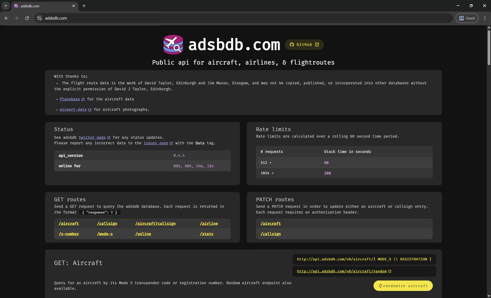

<p align="center">
	
</p>

<h1 align="center">adsbdb website</h1>

<p align="center">
	The frontend for <a href='https://www.adsbdb.com' target='_blank' rel='noopener noreferrer'>https://www.adsbdb.com</a>,
	<br>adsbdb api code <a href='https://www.github.com/mrjackwills/adsbdb' target='_blank' rel='noopener noreferrer'>here</a>
</p>
<p align="center">
	Built using <a href='https://vuejs.org/' target='_blank' rel='noopener noreferrer'>vue.js</a>,
	in <a href='https://www.typescriptlang.org' target='_blank' rel='noopener noreferrer'>Typescript</a>,
	using <a href='https://vitejs.dev/' target='_blank' rel='noopener noreferrer'>vite</a>,
	and <a href='https://vuetifyjs.com/en/' target='_blank' rel='noopener noreferrer'>Vuetify</a>,
</p>


## Screenshots

<p align="center">
	<a href="https://raw.githubusercontent.com/mrjackwills/adsbdb_site/main/.github/screenshot.png" target='_blank' rel='noopener noreferrer'>
		
	</a>
</p>


## Features

<ul>
	<li>PWA with Desktop & Mobile layout</li>
	<li>Brotli & Gzipped compressed output</li>
	<li><a href="https://pinia.vuejs.org/" target='_blank' rel='noopener noreferrer'>Pinia</a> for local data storage</li>
	<li>Client side routing with <a href="https://router.vuejs.org/" target='_blank' rel='noopener noreferrer'>Vue Router</a></li>
	<li><strong>A+</strong> <a href='https://www.ssllabs.com/ssltest/analyze.html?d=www.adsbdb.com' target='_blank' rel='noopener noreferrer'>ssllabs</a> rating</li>
	<li><strong>A+</strong> <a href='https://securityheaders.com/?q=https%3A%2F%2Fwww.adsbdb.com%2F&followRedirects=on' target='_blank' rel='noopener noreferrer'>security headers</a> rating</li>
	<li><strong>A+</strong> <a href='https://observatory.mozilla.org/analyze/www.adsbdb.com' target='_blank' rel='noopener noreferrer'>Mozilla observatory</a> rating</li>
	<li>Github release workflow</li>
	
</ul>

## Required software

1) <a href='https://nodejs.org/en/' target='_blank' rel='noopener noreferrer'>Node.js</a> - runtime

File that are required by adsbdb site
| file | reason|
|---|---|
|```./.env.development```	| development environmental variables|
|```./.env.production```	| productions environmental variables|

### Development

Use `.devcontainer/Dockerfile` to create an ideal dev environment

1) Install all required packages ```npm install```

2) Run locally ```npm run serve```

### Build step
---
```npm run build```